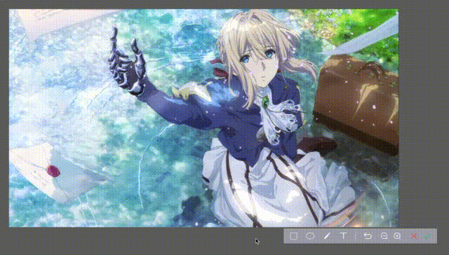

# vue-image-annotation

vue 图片批注组件



## 示例

demo [https://wawjqyh.github.io/vue-image-annotation/](https://wawjqyh.github.io/vue-image-annotation/)

## 安装

npm

```
$ npm install vue-image-annotation
```

## 使用

```vue
<template>
  <div>
    <button @click="handleOpenDrawer">打开图片</button>
    <VueImageAnnotation ref="refImageDrawer" @onSave="handleSave" />
  </div>
</template>

<script>
import VueImageAnnotation from 'vue-image-annotation';

export default {
  components: { VueImageAnnotation },

  methods: {
    handleOpenDrawer() {
      // 通过 openUrl 打开批注工具，传入需要批注的图片的地址
      this.$refs.refImageDrawer.openUrl('./img.jpeg');
    },

    // 点击保存时，会将批注后的图片内容通过两种格式返回
    handleSave(base64, file) {
      console.log(base64);
      console.log(file);
    }
  }
};
</script>
```

## Methods

| 方法名     | 说明                                       | 参数                                |
| ---------- | ------------------------------------------ | ----------------------------------- |
| openUrl    | 打开图片批注组件，传入图片 url             | url\|String: 图片地址               |
| openBase64 | 打开图片批注组件，传入 base64 格式图片内容 | base64\|String: base64 格式图片内容 |

注意：

`openUrl` 内部使用 `fetch` 获取图片内容，获取后添加到 `canvas` 中。请注意跨域问题

如果使用 `openUrl` 遇到问题，可以尝试自行获取图片内容，转成 `base64` 后通过 `openBase64` 方法打开组件

## Events

| 事件名称 | 说明           | 回调参数                            |
| -------- | -------------- | ----------------------------------- |
| onSave   | 保存图片时触发 | base64\|String: base64 格式图片内容 |
|          |                | file\|String: 二进制图片内容        |
